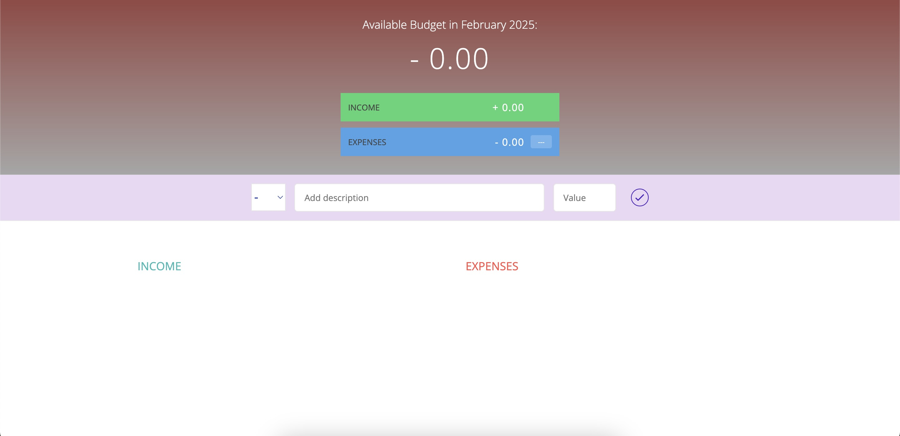
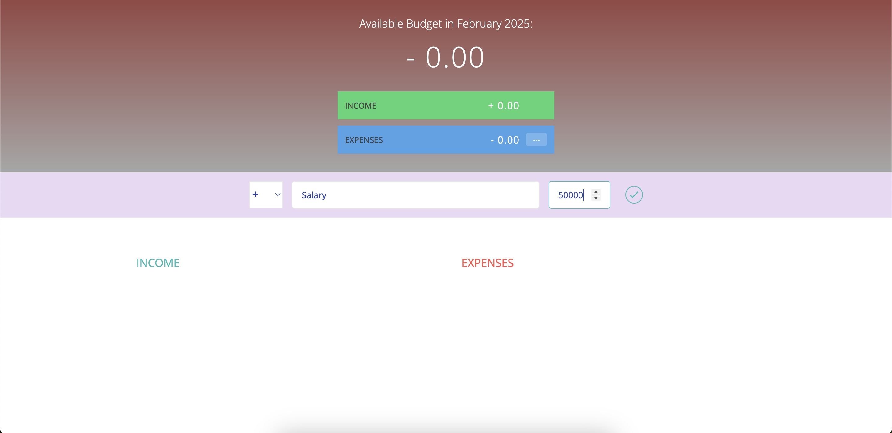
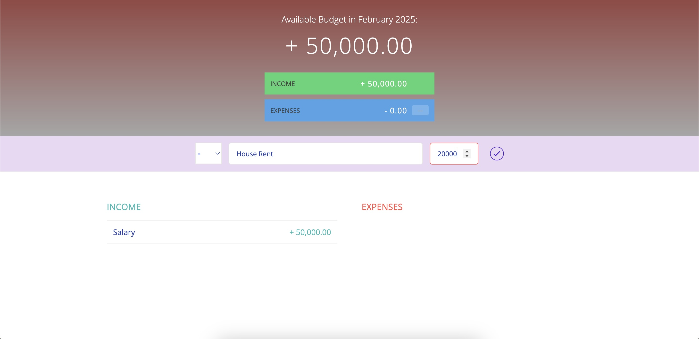
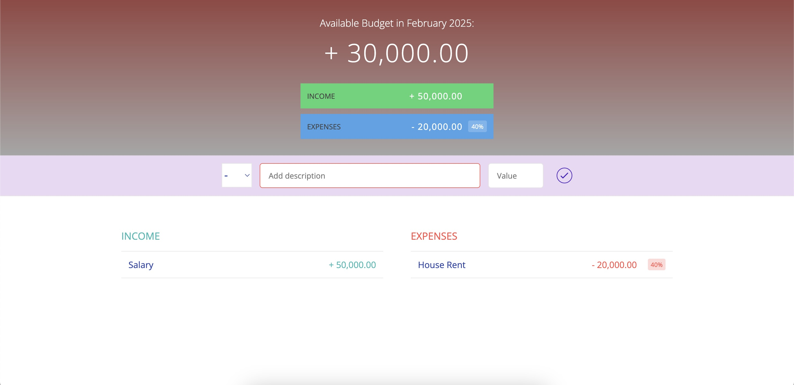

# Monthly-Expense-Calculator
## **Project Overview**  

The project utilizes **HTML** and **CSS** for the frontend, while **JavaScript** is used for backend calculations. It displays the user's total monthly expenses and the remaining budget, along with the percentage of the budget that has been spent.

## **Screenshots**  

The following screenshots display the homepage of the Expense Calculator.  

The following screenshot displays adding income to the calculator.

The following screenshot displays adding expense to the calculator.

The following screenshot displays final budget of the month.

